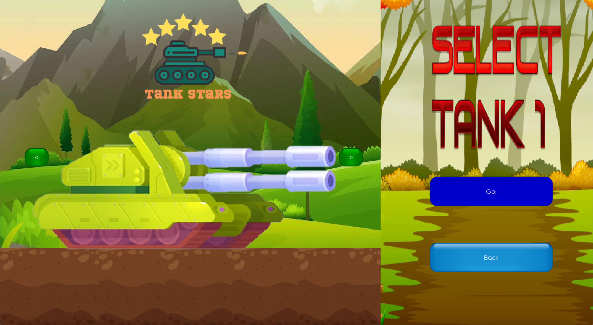

# Tank Stars

Tank Stars, a two player game wherein players take turns shooting missiles to destroy their opponent's tank.  
The final project of the course Advanced Programming (CSE201), required usage of principles of OOPS and GUI using Java and Libgdx.  

All code to run the game is in the **_test_** folder.  
The **_assets_** folder contains all the sprites used to make the game.

## Tech Stack

* Java
* LibGDX

## Features

* Fully functional game
* Choice between 3 different tank sprites
* Background music
* Can adjust the power and angle of shot
* Health bar and fuel bar update in real time
* Can save and load progress of up to 2 games

## Use Case Diagram

## Class Relations Diagram

## Main Menu

## Tank Selection

## In Game

Creators:  
[Jyotirmaya](https://github.com/JyotirS420) | [Sahil](https://github.com/sahilence)

